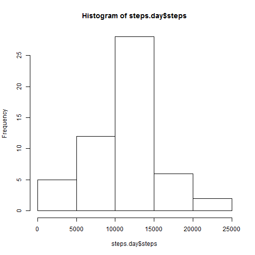
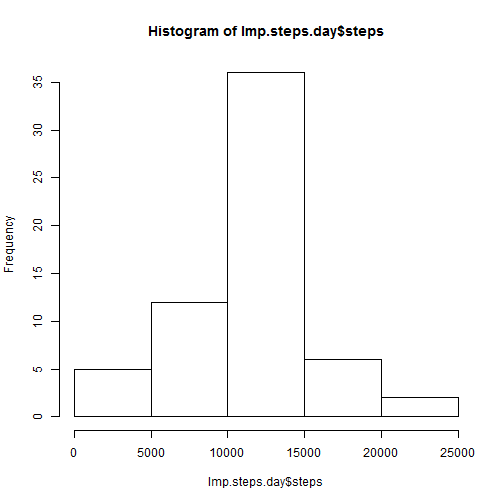
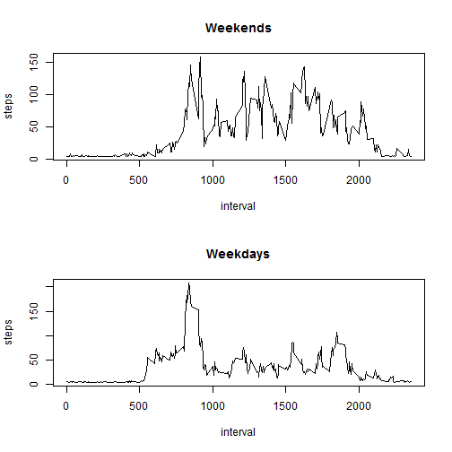

## Loading and preprocessing the data

```r
library(knitr)
library(timeDate)
library(xlsx)
```

```
## Loading required package: rJava
## Loading required package: xlsxjars
```

```r
library(XML)
library(data.table)
```

```
## data.table 1.9.4  For help type: ?data.table
## *** NB: by=.EACHI is now explicit. See README to restore previous behaviour.
```

```r
setwd("c:/HW/ReproResearch/data")
stepdata <- read.table("activity.csv", sep=",",header=TRUE)
head(stepdata)
```

```
##   steps       date interval
## 1    NA 2012-10-01        0
## 2    NA 2012-10-01        5
## 3    NA 2012-10-01       10
## 4    NA 2012-10-01       15
## 5    NA 2012-10-01       20
## 6    NA 2012-10-01       25
```

```r
StepTrans <- data.frame(steps=as.numeric(stepdata$steps),date=as.Date(stepdata$date), interval=stepdata$interval)
sum(is.na(StepTrans$steps))
```

```
## [1] 2304
```

```r
sum(is.na(StepTrans$date))
```

```
## [1] 0
```

```r
sum(is.na(StepTrans$interval))
```

```
## [1] 0
```


## What is mean total number of steps taken per day?


```r
good <- complete.cases(StepTrans)

compcases <- StepTrans[good, ]

steps.day <- aggregate(steps ~ date, data=compcases, FUN=sum)
hist(steps.day$steps)
```

 

```r
mean(steps.day$steps)
```

```
## [1] 10766.19
```

```r
median(steps.day$steps)
```

```
## [1] 10765
```


## What is the average daily activity pattern?

What is the average daily activity pattern?

```r
steps.interval <- aggregate(steps ~ interval, data= compcases, FUN=mean)
plot(steps ~  interval, steps.interval, type = "l")
```

 

```r
maxInt <- max(steps.interval$steps)
StepMaxInt <- subset(steps.interval,steps.interval$steps==maxInt)
StepMaxInt 
```

```
##     interval    steps
## 104      835 206.1698
```


## Imputing missing values

Imputing missing values

```r
### missing values
totalObs <- length(StepTrans$steps) 
## Number of observations missing in steps
sum(is.na(StepTrans$steps))
```

```
## [1] 2304
```

```r
## similar calculations reveal no missing values in the "date" and "interval" columns
AvgStepsInt <- mean(compcases$steps)
head(AvgStepsInt)
```

```
## [1] 37.3826
```


## Are there differences in activity patterns between weekdays and weekends?

```r
ImputedSteps <- data.frame(steps=ifelse(is.na(StepTrans$steps), AvgStepsInt, StepTrans$steps),date=StepTrans$date, interval=StepTrans$interval)
Imp.steps.day <- aggregate(steps ~ date, data=ImputedSteps, FUN=sum)
hist(Imp.steps.day$steps)
```

 

```r
mean(Imp.steps.day$steps)
```

```
## [1] 10766.19
```

```r
median(Imp.steps.day$steps)
```

```
## [1] 10766.19
```

```r
## The date is being misread
Imp.steps.interval <- aggregate(steps ~ interval + date, data=ImputedSteps, FUN=sum)

##work from here
v <- c("Monday","Tuesday", "Wednesday", "Thursday", "Friday")
Imp.steps.interval$Day <- ifelse(weekdays(Imp.steps.interval$date) %in% v,  "Weekday", "Weekend")
Imp.steps.interval$Day <- as.factor(Imp.steps.interval$Day)

WE.steps.interval <- subset(Imp.steps.interval, Imp.steps.interval$Day =="Weekend")
WE.Aggregate <- aggregate(steps ~  interval, data= WE.steps.interval, FUN=mean)


WD.steps.interval <- subset(Imp.steps.interval, Imp.steps.interval$Day =="Weekday")
WD.Aggregate <- aggregate(steps ~  interval, data= WD.steps.interval, FUN=mean)
opt  = par(mfrow= c(2,1))
plot(steps ~  interval, WE.Aggregate, type = "l", main="Weekends")
plot(steps ~  interval, WD.Aggregate, type = "l", main="Weekdays")
```

 

```r
par(opt)
```
